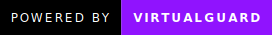

# SigNinja

A generic .NET analysis framework for efficient signature creation and identification, aiding in the automatic de-virtualization of VM-based obfuscators.

[Generic Structure](#structure) • 
[Signature Generation](#usage) • 
[Roadmap](#roadmap) •
[Credits](#credits)

## Structure

SigNinja uses a pretty generic structure and is intended to be able to be built to work with multiple platforms. It consists of a few main concepts:
 - Serialization
 - Deserialization
 - Signatures
 - Identifiers

SigNinja is intended to be used to not only identify signatures present within a target file, but to provide the ability to quickly and efficiently build signatures to search for. Using these four concepts, which are present in the core library, in order: `ISignatureSerializer`, `SignatureBase`, `IIdentifier`, one can write their own platform.

A platform will consist of a series of **signature types**. These signature types are not intended to have a massive amount of overriding code/be really interacting with that main base class, they are however used for the purposes of the comparer. It is a method of instantly determining whether or not a signature is equal to another or not.

For example, in the AsmResolver platform, there will be signatures such as `TypeSignature` & `MethodSignature`. When comparing these two, they are two different types, therefore the comparer will not waste valuable time doing further comparisons.

Each signature type contains a list of **identifiers**. These are the main method of comparison and resolution of signatures, and are what truly make the signature, well, a signature.

Examples of these can be viewed in the AsmResolver platform, located in `SigNinja.Platforms.AsmResolver.Identifiers`. They are more of a micro versus macro scale trait of a signature, and therefore signatures should contain multiple identifiers to be able to ensure accurate resolution.

### Signature Comparer

The signature comparer is used to, as stated in the name, compare signatures. By default, it will ensure that a signature has 100% of the identifiers that it shares with another signature. There is an overload to put in a minimum percentage for likeness, which in my mind I would intend to use for obfuscated binaries, where signatures may have slight variations.

## Usage and Signature Generation

I have yet to implement a CLI for this, but when I do, I will populate this tab.

## Roadmap

I intend to add signatures for method bodies, allowing for somebody to essentially de-obfuscate a virtual machine only once, generate signatures on their de-obfuscated code, and then have it work flawlessly after.

## Credits
 - [Washi](https://github.com/Washi1337), for [AsmResolver](https://github.com/Washi1337/AsmResolver)

